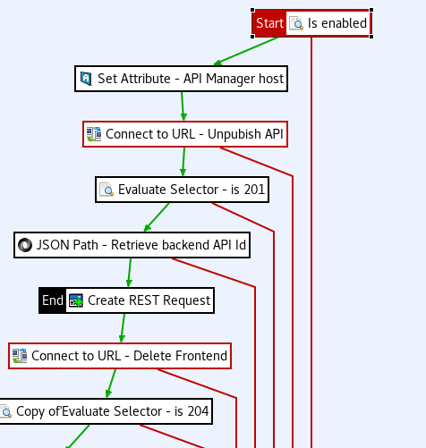

# Incremental API Deployment script

Deploy script will update the existing API with new version of API and copy all of existing API dependencies like applications, organizations, quotas to New API without any downtime.


## API Management Version Compatibility
This project successfully tested with following versions:
- Axway AMPLIFY API Management v7.7.20211130


## Prerequisites

- Axway AMPLIFY API Management 7.7
- JDK 1.8.0_xxx
- Apache Maven 3.3.9 or above

## Build the project

```bash
$mvn clean package 
```

## Help

```

-c, --clusterurl=<urls>   Space seperated API Manager Cluster URLs
-e, --url=<url>           API Manager URL
-h, --help                Show this help message and exit.
-i, --openapi=<openAPI>   Open API File location
-n, --name=<apiName>      API  name
-o, --organization_name=<orgName> API Manager Development Organization name
-p, --password=<password> API Manager Password
-s, --skipSSL             SKIP SSL server validation
-u, --username=<username> API Manager Username
-V, --version             Print version information and exit.

```

## Usage

Deployment script does the following. 

1. Authenticate with API manager using command line parameters username and password. 
2. Fetch Organization id from organization name. 
3. Fetch Frontend API by passing api name as a parameter. 
4. If step 3 is success, fetch backend details and compare openapi from API manager and input openapi parameter. 
5. If there are no differences in input and existing open api, the process stops. 
6. If there are differences, it goes to step 4
7. Creates backend api
8. Creates frontend api 
9. Copy frontend API security from existing API
10. publish frontend API
11. Copy all dependencies (applications, organizations, quotas) from existing API to new API. 
12. Poll API Gateway catalog until new APIs are updated with status **published**. ( if clusters of API gateway is provided as input, it polls all API Gateways catalog for status **published**)
13. Deprecate the exiting API with retirement date. 
14. The retired API could be deleted in two ways
    1. Enable retirement alert on API manager, and enhance alert policy to delete API. [Sample policy](alert_cleanup_policy.xml). 
       1. If more than one API Gateways are deployed, add check on alert policy via evaluate filter like ${environment.alert.equals(“true”)}
       2. Set up an environment variable ( $export alert=true) on an API Gateway machine which needs to process alerts.
       3. If the environment variable is set, it will process  the alert polices otherwise it will ignore it.
          
    2. Wait for retirement date in effect and delete API. 
    

## Deploy API without checking all API Gateway servers in a cluster for deployment API replication. 

```
$java -jar westpac-deployment-1.0.1.jar -e https://10.129.58.31:8077 -u apiadmin -p changeme -n petstore -o Development -i swagger.json -s
```

## Deploy API and check all API Gateway servers in a cluster for deployment API replication.

```
-e https://10.129.58.31:8077 -c https://10.129.58.32:8077 https://10.129.58.33:8077  -u apiadmin -p changeme -n pestore -o Westpac -i swagger.json -s
```

## Contributing
Please read [Contributing.md](https://github.com/Axway-API-Management-Plus/Common/blob/master/Contributing.md) for details on our code of conduct, and the process for submitting pull requests to us.

## Team


Axway Team


## License
[Apache License 2.0](/LICENSE)
